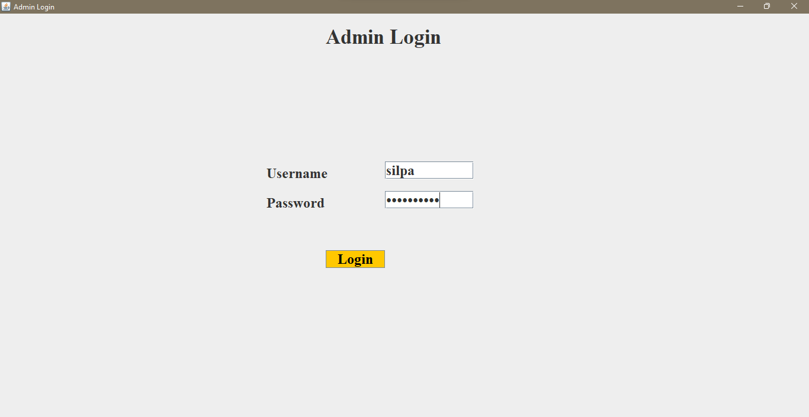

# Blood Donation Management System
It is a standalone application. 
 This project includes a database system which stores the details of blood donors. 
 Java swing is used to create the user interface. 
 Mysql database is connected to java swing using jdbc. 
 There is a login page where an admin can login using the login crendentials which is already stored in a database. 
 After login the user will be redirected to a page where they can add donors as well as check donors with specified blood group. 
 In the search window there is a dropdown to select the blood group and the details of donors with corresponding blood group will be displayed. 
 Donor details can be entered into textfields provided and and it will be automatically inserted into our blood_donation_database. 
  
 
 
 
 
